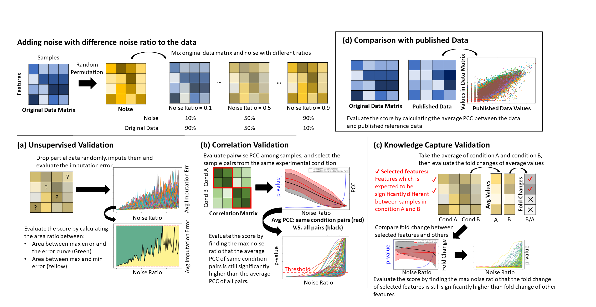

# Omics Compendium Validator (OCV): A validation module for omics compendium validation

This validation module contains four Python scripts to validate the omics compendia with four different validation approaches.

# Overview
The validation approaches assumes that a high quality omics compendium has the following four properties:
- Low imputation errors
- The average pairwise Pearson Correlation Coefficient (PCC) of the samples from the same conditions are higher than the average pairwise PCC of the entire samples
- Capable to capture the information of differential expression genes (DEG): Given two conditions and the corresponded DEG as selected genes, the corresponded fold change between two conditions of the selected genes should be significantly higher/lower than the fold change of other genes
- High consistency compared with published data

In addition, the validation approaches assumes that a high quality compendium should keep these properties even it is perturbed by mixing with the noise -- a random permuted compendium.

By evaluating the imputation errors with difference noise ratio, evaluating the max noise ratio that the perturbed compendium still has the properties with specified significance, the validation approaches can evaluate the quality of the input omics compendium.



**Figure 1. Basic idea of the design of Omics Compendium.** The OCV assumes that a high quality compendium has four properties. A high quality compendium should keep these properties even it is perturbed by mixing the noise. By quantifying and tracking these four properties of the compendia with different noise ratio, the validation approach can evaluate the quality of the input compendium.

# Directories
- [`Examples`](./Examples): The folder contains the examples of evaluating the quality of five compendia with four different validation approaches. It contains all necessary files such as the compendium, labels of experimental conditions, information of DEG, and published dataset in comma separate value (.csv) format.
- [`Scripts`](./Scripts): The folder contains the scripts of the OCV.

# Getting Started

Download the entire repository:
```
git clone https://github.com/IBPA/OCB.git
```

## Dependencies

The OCV runs in Python 3.7 (tested under version 3.7.9) with the following package installed:

```
pandas==1.2.4
missingpy==0.2.0
scikit-learn==0.20.1 (The later version may not be compatable with missingpy package)
matplotlib==3.4.2
```

## Running

The following example demostrate the evaluation of a Salmonella transcriptomic compendium.

Make sure that the `Scripts` directory contains the following files:

```
Utils.py
UnsupervisedValidation.py
CorrelationValidation.py
KnowledgeCaptureValidation.py
PublishedDataComparison.py
```

Also, make sure the `Examples` directory contains the following files:

```
Dataset/Salmonella.csv
CorrelationValidation/SalmonellaCorrelationExample.csv
KnowledgeCaptureValidation/KnowledgeCapture_samples.csv
KnowledgeCaptureValidation/KnowledgeCapture_genes.csv
PublishedDataComparison/SalmonellaPublishedData.csv
```

For demo, add `--demo` flag to the command (except published data comparison, which is not time consuming). The number of trials, noise ratio steps, and the size of the dataset will be reduced to reduce the computation time for demonstration.

Addition argument can be added to generate the plot, table of imputation error/p-value, and table of scores. Please check the argument by adding `--help` flag to the command.

### Unsupervised Validation

Run unsupervised validation using the following command:
```
python Scripts/UnsupervisedValidation.py Examples/Dataset/Salmonella.csv --demo
```

The result will be shown as follows (If you do not run the demo mode, the first line will not appear, and the score may be different due to randomness).

```
Running Demo Mode!
Unsuperivsed validation result of input Examples\Dataset\Salmonella.csv :
Compendium size (#features, #samples) : (468, 12)
Average score of 3 trials : 0.491 +/- 0.089
```

### Correlation Validation

Correlation validation requires one additional input -- condition labels of samples:

```
python Scripts\CorrelationValidation.py Examples\Dataset\Salmonella.csv Examples\CorrelationValidation\SalmonellaCorrelationExample.csv --demo
```

The result will be shown as follows (If you do not run the demo mode, the first line will not appear, and the score may be different due to randomness).

```
Running Demo Mode!
Correlation validation result of input Examples\Dataset\Salmonella.csv :
Compendium size (#features, #samples) : (4672, 116)
#pairs (All samples) : 6670
#pairs (Same condition samples) : 50
Average score of 3 trials : 0.333 +/- 0.189
```

### Knowledge Capture Validation

Knowledge capture validation requires the following inputs:

- Path of input compendium
- Path of input condition labels
- Condition label (control)
- Condition label (experimental case)
- Path of feature list which is expected to be significantly increase/decrease in experimental case compared with control
- up or down (to specify the expected changes observed in experimental case)

```
python Scripts\KnowledgeCaptureValidation.py Examples\Dataset\Salmonella.csv Examples\KnowledgeCaptureValidation\KnowledgeCapture_samples.csv  no_fur fur Examples\KnowledgeCaptureValidation\KnowledgeCapture_genes.csv down --demo
```

The result will be shown as follows (If you do not run the demo mode, the first line will not appear, and the score may be different due to randomness).

```
Running Demo Mode!
Knowledge capture validation result of input Examples\Dataset\Salmonella.csv :
Compendium size (#features, #samples) : (4672, 116)
#Control Condition Samples : 2
#Experimental Condition Samples : 1
#selected features : 18
#non-selected features : 4654
Average score of 3 trials : 0.933 +/- 0.047
```

### Compare with published data

Published data comparison simply takes input compendium and published data:

```
python Scripts\PublishedDataComparison.py Examples\Dataset\Salmonella.csv Examples\PublishedDataComparison\SalmonellaPublishedData.csv
```

It is not necessary that the samples and features in input compendium and published data must be the same : The common features and samples will be extracted for comparison. In addition, multiple samples in input compendium can be mapped into one sample in published data. For further details, view help with `--help` flag or check the published dataset directly.

The result will be shown as follows. (If more than one samples. If there are more than one samples in the input compendium mapped into one sample in published data, notices will be shown)
```

Notice: More than one samples in input compendium mapped to one sample in published data

Samples :
SRR951029
SRR951030
SRR951031

Notice: More than one samples in input compendium mapped to one sample in published data

Samples :
SRR951034
SRR951035

Published Data Comparison:
input compendium : Examples\Dataset\Salmonella.csv
published data : Examples\PublishedDataComparison\SalmonellaPublishedData.csv

Compendium size (#features, #samples) : (4672, 116)
Published data size (#features, #samples) : (4367, 26)
Data size for comparison (#features, #samples) : (4351, 26)

Average samplewise PCC = 0.850 +/- 0.053
```

# Authors

- [ChengEn Tan](https://github.com/bigghost2054) as the project lead, main author, and the main developer.
- [Fangzhou Li](https://github.com/fangzhouli) as the metadata pipeline developer and the code reviewer.
- [Dr. Minseung Kim](https://github.com/minseven) as the technical advisor.
- [Dr. Ilias Tagkopoulos](https://github.com/itagkopoulos) as the project supervisor and advisor.

<!-- TODO if we want to list more detailed contact info like ChengEn's. -->
# Contact

For any questions, please contact us at tagkopouloslab@ucdavis.edu.

<!-- # Citation

TODO -->

# License

This project is licensed under the Apache 2.0 License - see the [LICENSE](./LICENSE) file for details.

<!-- If we have any. -->
<!-- # Acknowledgements

TODO -->

<!-- # References

<ol>
	<li>Langmead, B. & Salzberg, S. L. Fast gapped-read alignment with Bowtie 2. Nat Methods 9, 357–9 (2012).</li>
	<li>Anders, S., Pyl, P. T. & Huber, W. HTSeq--a Python framework to work with high-throughput sequencing data. Bioinformatics 31, 166–9 (2015).</li>
	<li>Guimera, R. V. bcbio-nextgen: Automated, distributed next-gen sequencing pipeline. EMBnet. journal 17, 30 (2011).</li>
	<li>Stein, L. Generic feature format version 3 (GFF3). Seq. Ontol. Proj 1, (2013).</li>
	<li>Cock, P. J. A., Fields, C. J., Goto, N., Heuer, M. L. & Rice, P. M. The Sanger FASTQ file format for sequences with quality scores, and the Solexa/Illumina FASTQ variants. Nucleic Acids Res 38, 1767–1771 (2010).</li>
	<li>Kodama, Y., Shumway, M. & Leinonen, R. The Sequence Read Archive: explosive growth of sequencing data. Nucleic acids research 40, D54–D56 (2011).</li>
	<li>Cock, P. J. et al. Biopython: freely available Python tools for computational molecular biology and bioinformatics. Bioinformatics 25, 1422–1423 (2009).</li>
	<li>Lipman, D. J. & Pearson, W. R. Rapid and sensitive protein similarity searches. Science 227, 1435–1441 (1985).</li>
	<li>Wang, L., Wang, S. & Li, W. RSeQC: quality control of RNA-seq experiments. Bioinformatics 28, 2184–5 (2012).</li>
	<li>Yoo, A. B., Jette, M. A. & Grondona, M. Slurm: Simple linux utility for resource management. in Workshop on Job Scheduling Strategies for Parallel Processing 44–60 (Springer, 2003).</li>
	<li>Li, H. et al. The sequence alignment/map format and SAMtools. Bioinformatics 25, 2078–2079 (2009).</li>
	<li>Stekhoven, D. J. & Buhlmann, P. MissForest--non-parametric missing value imputation for mixed-type data. Bioinformatics 28, 112–8 (2012).</li>
	<li>Massey Jr, F. J. The Kolmogorov-Smirnov test for goodness of fit. Journal of the American statistical Association 46, 68–78 (1951).</li>
	<li>Benesty, J., Chen, J., Huang, Y. & Cohen, I. Pearson correlation coefficient. in Noise reduction in speech processing 1–4 (Springer, 2009).</li>
	<li>Hauke, J. & Kossowski, T. Comparison of values of Pearson’s and Spearman’s correlation coefficients on the same sets of data. Quaestiones geographicae 30, 87–93 (2011).</li>
	<li>Kroger, C. et al. An infection-relevant transcriptomic compendium for Salmonella enterica Serovar Typhimurium. Cell Host Microbe 14, 683–95 (2013).</li>
	<li>Colgan, A. M. et al. The Impact of 18 Ancestral and Horizontally-Acquired Regulatory Proteins upon the Transcriptome and sRNA Landscape of Salmonella enterica serovar Typhimurium. PLoS Genet 12, e1006258 (2016).</li>
</ol> -->
